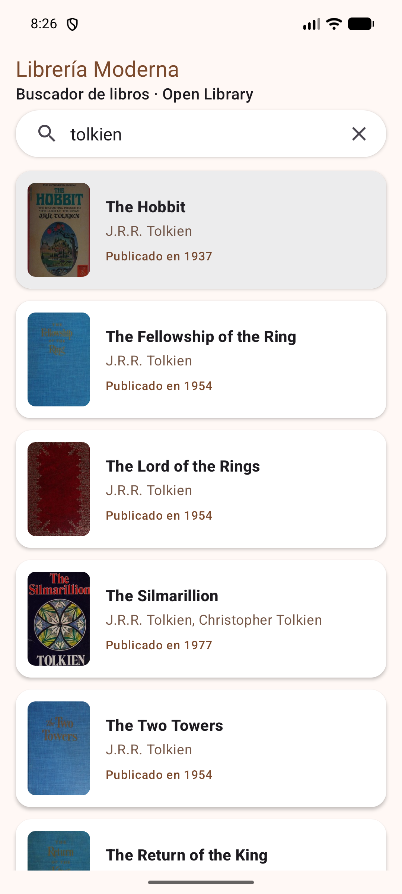
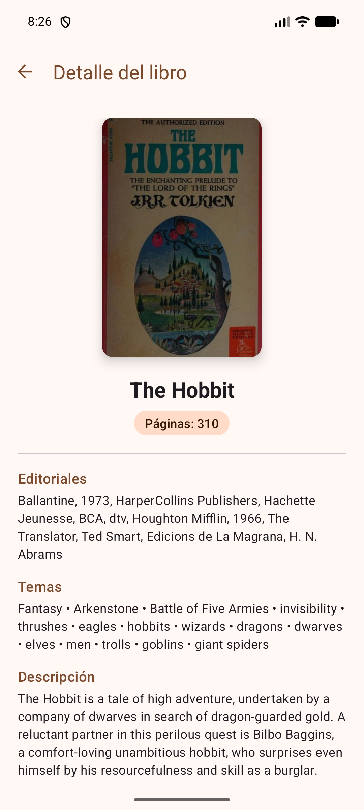

# 📚 Librería Moderna

Aplicación Android para buscar libros por título o autor usando la **Open Library Search API**.
Desarrollada en **Kotlin** con arquitectura **MVVM** y una capa **Repository**.

> 🎥 **Video demostrativo:** [Ver acá](PEGAR_LINK_DEL_VIDEO)

---

## Capturas

<p align="center">
  
  &nbsp;&nbsp;&nbsp;
  
</p>

---

## Funcionalidades

- 🔍 **Búsqueda** de libros por título o autor.
- 📋 **Lista de resultados** (RecyclerView) con portada, título, autores y año de primera publicación.
- 📖 **Detalle del libro** (Fragment) con portada grande, cantidad de páginas, editoriales, temas (subjects), descripción y enlace a Open Library.
- ⏳ **Indicador de carga** con ProgressBar.
- ⚠️ **Manejo de errores**: sin conexión a internet, tiempo de espera agotado, errores HTTP y búsquedas sin resultados.
- 🔄 **Soporta la rotación de pantalla** sin perder los datos ni repetir peticiones.
- 🌙 **Tema claro y oscuro** con una paleta propia de Material 3.

---

## Tecnologías

| Área | Tecnología |
|---|---|
| Lenguaje | Kotlin |
| Arquitectura | MVVM + Repository Pattern |
| Red | Retrofit + Gson |
| Asincronía | Corrutinas de Kotlin (`viewModelScope`) |
| Estado de la UI | ViewModel + LiveData |
| Listas | RecyclerView + ListAdapter + DiffUtil |
| Imágenes | Glide |
| Vistas | ViewBinding, Material Components 3 |

---

## Arquitectura

```
Vista (Activities / Fragment / Adapter)
        │  eventos del usuario      ▲  observa el UiState (LiveData)
        ▼                           │
ViewModel (SearchViewModel / BookDetailViewModel)
        │  llamadas suspend         ▲  Result<T>
        ▼                           │
Repository (BookRepository)
        │                           ▲  data classes (Gson)
        ▼                           │
Red (OpenLibraryApi + RetrofitClient)  ──HTTPS──▶  Open Library API
```

- **Vista**: solo muestra el estado que expone el ViewModel y le envía los eventos del usuario. No contiene lógica de negocio.
- **ViewModel**: lanza las corrutinas, expone un `LiveData<UiState>` de solo lectura y sobrevive a los cambios de configuración (por ejemplo, la rotación).
- **Repository**: única fuente de datos. Combina las llamadas a la API y envuelve cada resultado en un `Result`, así ninguna excepción llega a la interfaz.
- **Red**: interfaz de Retrofit que describe los endpoints; Gson convierte el JSON en data classes de Kotlin.
- **Inyección de dependencias (manual)**: el Repository recibe la API por constructor, y cada ViewModel recibe el Repository de la misma forma.

### Estructura del proyecto

```
com.example.libreriamoderna
├── data
│   ├── model        → Book, SearchResponse, WorkDetail, BookDetail
│   ├── remote       → OpenLibraryApi, RetrofitClient
│   └── repository   → BookRepository
├── ui
│   ├── search       → MainActivity, SearchViewModel, BookAdapter (+ BookViewHolder)
│   └── detail       → DetailActivity, BookDetailFragment, BookDetailViewModel
└── util             → UiState, ErrorMapper
```

### Navegación y pasaje de datos

1. `MainActivity` abre `DetailActivity` con un **Intent** que lleva el `workId` del libro.
2. `DetailActivity` contiene a `BookDetailFragment`, que se crea con `newInstance(workId)`. El id se guarda en los **arguments** del Fragment (un `Bundle`), por lo que se conserva aunque el sistema lo recree.
3. El Fragment libera su ViewBinding en `onDestroyView()` y observa con `viewLifecycleOwner` para evitar memory leaks.

---

## API

URL base: `https://openlibrary.org/`

| Uso | Endpoint |
|---|---|
| Buscar libros | `GET search.json?q={búsqueda}&fields=key,title,author_name,first_publish_year,cover_i` |
| Descripción y temas | `GET works/{workId}.json` |
| Páginas y editoriales | `GET search.json?q=key:/works/{workId}&fields=key,number_of_pages_median,publisher` |
| Portadas | `https://covers.openlibrary.org/b/id/{cover_i}-M.jpg` (`-L` para la grande) |

La pantalla de detalle combina las dos peticiones de detalle en un único modelo `BookDetail`, que arma el Repository.

---

## Manejo de errores

`UiState` es una sealed class con tres estados: `Loading`, `Success` y `Error`.
`ErrorMapper` traduce las excepciones técnicas a mensajes para el usuario definidos en `strings.xml`:

| Excepción | Mensaje mostrado |
|---|---|
| `IOException` | Sin conexión a internet |
| `SocketTimeoutException` | El servidor tardó demasiado en responder |
| `HttpException` | Error del servidor (HTTP 4xx / 5xx) |
| Lista vacía | No se encontraron libros |

---

## Cómo ejecutarla

1. Clonar el repositorio:
   ```bash
   git clone https://github.com/Tomszip/ModernBookstore.git
   ```
2. Abrir el proyecto en **Android Studio**.
3. Esperar a que termine la sincronización de Gradle.
4. Ejecutar la app en un emulador o dispositivo con acceso a internet (**minSdk 24**).

---

## Autor

**TU NOMBRE** · Aplicaciones Móviles · Primer parcial, Tema 3 (Open Library API)
